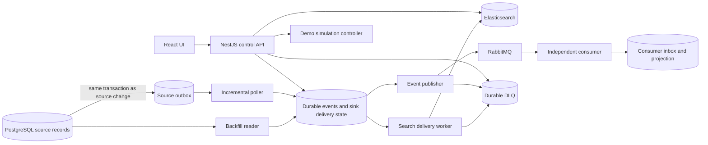

# Optio Data Replication Assignment: Analysis and Implementation Guide

This document explains the assignment in English and proposes a concrete path to completing it. It is a design and execution plan only. No application, infrastructure, or verification scripts have been implemented, and no gate has been run or passed.

## 1. What you are being asked to build

Build a recoverable data replication system that reads a relational database and delivers data to two destinations:

1. **A searchable current-state index**, proposed here as Elasticsearch. Each entity should have one current searchable representation.
2. **An event stream**, proposed here as RabbitMQ, with at least one separately running consumer that demonstrably processes the events.

The pipeline must support a large initial load, called **backfill**, and ongoing **incremental synchronization** at a configurable interval. Both modes must operate concurrently against the same source. Changes must continue to propagate while the historical scan is still running.

A React UI must show the system's state, let a user browse replicated data, expose operational controls, and provide ways to trigger failures and source changes.

The central deliverable is an automated verification command that actually causes failures and checks the outcome. A plausible architecture, screenshots, or a README claiming reliability will not satisfy the assignment on their own.

### Required outcomes versus proposed choices

| Area | Required by the assignment | Proposed implementation choice |
| --- | --- | --- |
| Source | Relational database | PostgreSQL |
| Search destination | Searchable current state | Elasticsearch |
| Event destination | Change stream with an independent consumer | RabbitMQ and a separate NestJS consumer |
| Loading | Concurrent backfill and incremental sync | Keyset scan plus transactional source outbox polling |
| Recovery | Resume safely after an abrupt process kill | Durable work staging, checkpoints, and recoverable claims |
| Delivery | Explicit, demonstrated duplicate handling | At-least-once delivery with effectively-once sink effects |
| Partial rejection | Preserve 497 valid items and quarantine 3 invalid items | Per-item bulk response handling and a durable DLQ |
| Visibility | Progress, throughput, lag, DLQ, health | Metrics endpoint, structured logs, React dashboard |
| Control | Start/stop loading, replay, configuration, simulations | NestJS control API and an isolated demo controller |
| Verification | One command checks all five gates | `make verify` and/or `./verify.sh` |
| Scale | Large enough to invalidate loading everything into memory | Default verification dataset of 2 million realistic records |

The technology list describes the team's stack. It does not explicitly require using every listed product. Redis, S3, ClickHouse, and Apache NiFi can be omitted unless they solve a concrete requirement. Adding them solely to match the list increases the amount of infrastructure that must be explained and tested.

## 2. What the five gates mean

| Gate | What must be demonstrated | What does not count as proof |
| --- | --- | --- |
| G1: Crash recovery | Kill the worker during backfill, restart it, observe resumption from durable progress, and reconcile all expected data. | Graceful shutdown only; restarting from zero; relying on in-memory offsets. |
| G2: No harmful duplicates | Repeated failures cause no duplicate logical effects and no stale final state. State the actual delivery guarantee. | Assuming RabbitMQ deduplicates messages; comparing only total document counts. |
| G3: Destination outage | Stop Elasticsearch during work, observe controlled retries, restore it, and verify automatic catch-up with no loss. | Swallowing errors; dropping records after retry exhaustion; a tight retry loop. |
| G4: Partial batch failure | Send one actual 500-item batch where exactly 3 items are rejected; confirm 497 successes and 3 contextual DLQ entries. | Mocking the entire destination; failing or requeuing all 500 items because 3 failed. |
| G5: Observability | A user can determine progress, throughput, incremental lag, DLQ count, and health from metrics, logs, and UI. | A green process heartbeat that ignores failed destinations; decorative UI values. |

The example counts and timings in the assignment illustrate report formatting. They are not measurements to copy into the implementation. All reported figures must come from the actual verification run.

## 3. Recommended architecture



Use one PostgreSQL instance with separate source, pipeline, and consumer schemas for the assignment. This keeps setup manageable and allows source-outbox handoff and pipeline staging to share a local transaction. The consumer must still be a separate process with its own database role and independently owned tables; it must receive events through RabbitMQ.

This database arrangement is a deliberate demonstration constraint. In a deployment where the customer database and pipeline state are on separate servers, that handoff cannot share a transaction. It would need a separately designed idempotent acknowledgement protocol or a CDC connector.

### Suggested runtime services

| Service | Responsibility |
| --- | --- |
| PostgreSQL | Source records, immutable source changes, checkpoints, delivery work, DLQ, consumer receipts |
| NestJS API | Status, configuration, loading controls, search API, replay requests, UI updates |
| NestJS replication worker | Concurrent source readers and independent delivery loops |
| NestJS consumer | Consume RabbitMQ deliveries and commit deduplicated effects |
| Elasticsearch | Searchable entity state, explicit mappings, version-aware writes |
| RabbitMQ | Durable event delivery to the independent consumer |
| React UI | Dashboard, searchable records, DLQ, controls, simulations |
| Demo controller | Restricted start/stop operations against named demo containers |
| Verification runner | Provision fixtures, cause failures, assert gates, save reports |

Use Docker Compose, persistent data volumes, health checks, pinned dependency versions, and documented resource limits. Prometheus can be added to store time series; a metrics endpoint and an explicitly defined rate calculation are still necessary even if Grafana is omitted.

## 4. Correctness contract

Define this contract before writing the worker. It determines what the implementation and verification must prove.

### 4.1 Delivery guarantee

The proposed guarantee is **at-least-once transport with effectively-once materialized effects**.

An uncertain request may be retried. Elasticsearch must tolerate repeated entity versions. RabbitMQ may deliver an event more than once, while the consumer applies its logical effect once. This is not a claim of a single exactly-once transaction spanning PostgreSQL, Elasticsearch, and RabbitMQ.

There are two distinct identities:

- **Entity identity:** a stable source identifier, used as the Elasticsearch document ID.
- **Event identity:** a stable source/entity/version identity, reused by all retries and by both readers when they observe the same entity version.

A timestamp generated when publishing, a worker attempt number, or a new random UUID on every retry is unsuitable as the logical event identity.

### 4.2 Event envelope and source records

Use a small customer-like model: ID, name, email, segment, numeric balance, updated timestamp, monotonically increasing entity version, and a deletion flag. A flexible source attributes field can hold values that are valid in PostgreSQL JSON but invalid for a deliberately strict Elasticsearch field, enabling G4.

Each event should contain a schema version, event ID, entity ID, entity version, operation, source timestamp, canonical payload, and payload hash. Use `upsert` and `delete` as the canonical operations. Keep acquisition metadata such as backfill run ID and reader mode separate from the immutable logical payload.

For a given entity/version, both readers must produce identical canonical content. Version increments and the outbox insert must occur in the same transaction as the source mutation. Retrying ingestion must not produce a new logical version.

Treat versions as 64-bit values without losing precision in JavaScript. Use strings at JSON boundaries where appropriate and validate conversion for destination APIs.

### 4.3 Essential invariants

1. Every committed source mutation has a durable source change record.
2. A source change becomes handed off only when durable pipeline work exists.
3. A backfill checkpoint advances only in the transaction that stages its page.
4. Each event has separately tracked Elasticsearch and RabbitMQ delivery outcomes.
5. A delivery becomes terminal only after confirmed success, a verified stale/duplicate result, or durable quarantine.
6. Consumer acknowledgement happens only after its database transaction commits.
7. An older version never replaces a newer current state.
8. Retriable infrastructure failure never silently becomes data loss.
9. Memory usage is bounded by configured work windows rather than dataset size.
10. “Captured,” “delivered,” “consumed,” and “quarantined” remain separate observable states.

An item in the DLQ is preserved but not successfully delivered to the rejected destination. Reports and UI must retain that distinction.

## 5. Backfill and incremental synchronization

### 5.1 Capture every change with a transactional outbox

Prefer a source-table trigger or an equally enforced database write path that stores the after-image and entity version in an outbox in the same transaction. Retain deletion events as well. The fixture generator must use this path, including during the initial seed, so the expected event set is independently available from the source history.

Poll committed outbox rows that have not been handed off. Claim a bounded batch, insert canonical pipeline events and per-sink delivery rows idempotently, and mark those outbox rows handed off in the same local database transaction. Failed transactions leave the changes eligible for a later poll.

Do not implement incremental capture as “read IDs greater than the largest ID seen.” PostgreSQL sequences are visible independently of transaction commit and are not rolled back, so allocation order is not a safe substitute for commit order. A lower-numbered transaction can become visible after a higher-numbered one. [PostgreSQL transaction isolation documentation](https://www.postgresql.org/docs/18/transaction-iso.html)

The pending-row approach avoids that gap: a late-committing row remains eligible regardless of its ID. Index the pending state so each poll does not scan the entire history. Row locking with `SKIP LOCKED` can support competing queue workers; use it for work claiming, not for constructing a supposedly complete snapshot. [PostgreSQL SELECT documentation](https://www.postgresql.org/docs/current/sql-select.html)

This proposal requires permission to add source-side capture. If the intended integration is read-only, revise the design explicitly around supported CDC. Timestamp polling alone does not preserve every intermediate change or hard delete.

### 5.2 Read backfill in bounded pages

At run creation, persist a run ID, the upper entity-ID boundary, current checkpoint, configuration, and start time. Scan by primary key: IDs greater than the last committed checkpoint and no greater than the run boundary, ordered by ID, limited to the configured page size.

For each page, stage its events and sink delivery rows and update the checkpoint atomically. A crash before commit causes that page to be reread; a crash afterward leaves durable delivery work. This avoids making checkpoint advancement depend on a long network call.

Use one active backfill reader per run initially, with database ownership enforcement. Page size defaults to 500, with an additional byte limit for unusually large records. Avoid offset pagination and ORM operations that materialize every source row.

The persisted checkpoint is the last source position durably captured. It is not the last record delivered to both sinks. A backfill may be fully scanned while substantial delivery work remains outstanding.

### 5.3 Run both modes concurrently

Start incremental capture with backfill, reserve capacity for both modes, and continue polling while the scan runs. Initial outbox events and backfill observations can overlap; event identity and unique constraints collapse the same entity/version into one logical event.

This is a convergent backfill, not a frozen historical snapshot. A record may be read at a newer version than it had at run start. Every committed mutation is still retained in the outbox, and destination version checks ensure eventual current-state correctness.

For example, incremental delivery might apply entity 42 at version 8 before backfill delivers version 7. Version 7 must then be harmless. Retain deleted rows as source tombstones during the assignment so a late backfill page cannot erase knowledge of deletion.

New entities beyond the scan boundary are handled by incremental capture. Late commits with IDs below the checkpoint are also covered by pending outbox rows. Record counts at run start can be labelled as a baseline estimate during concurrent writes; do not report an exact completion percentage by dividing an ID by the total row count.

The event stream preserves distinct source versions, but the design does not promise global event order or a frozen bootstrap snapshot. Consumers that need ordered business transitions would require an additional ordering contract. The demonstration consumer should maintain a version-aware projection and an immutable receipt per logical event.

### 5.4 Fairness and backpressure

Reserve part of each delivery window for incremental events so a large backfill does not monopolize the sinks. Include aging or a minimum backfill share so continuous changes cannot starve the historical scan.

Bound source page size, bytes per request, concurrent requests, publisher confirmations in flight, and consumer prefetch. Use a durable pending-work high-water mark: when reached, pause further staging while retaining source changes in the outbox. Expose this as backpressure.

An outage can grow disk backlog even when memory stays bounded. Retain undelivered work, monitor free space, and document finite disk capacity. Never delete outstanding data to make the dashboard look caught up.

## 6. Sink delivery and recovery

### 6.1 Independent sink state

Store one delivery state per event and destination. Suggested fields are status, attempt count, next retry time, claim owner, claim generation, lease expiry, last error, and completion timestamp.

Use states such as pending, in flight, retry scheduled, delivered, superseded, and quarantined. Source handoff and sink acknowledgement are different state transitions.

Claim work in a short transaction, perform network I/O outside it, and commit the outcome only if the worker still owns the current claim generation. Expired claims become recoverable after a crash. Set request deadlines and lease renewal rules so old workers cannot overwrite newer delivery outcomes.

Elasticsearch failure must not prevent RabbitMQ from processing already-staged work, and broker failure must not directly block search delivery. A shared disk-capacity limit can eventually pause further intake; that condition should be explicit.

### 6.2 Elasticsearch idempotency and partial responses

Use a stable document ID and strict external versioning. Elasticsearch accepts a newer external version and rejects an equal or older one, protecting against reordered writes. Interpret a version conflict as an idempotent/superseded outcome only under this specific contract; investigate an equal-version payload mismatch. [Elasticsearch index API](https://www.elastic.co/docs/api/doc/elasticsearch/operation/operation-index)

Use versioned tombstone documents for deletions and filter them out of normal search. Keeping the version marker prevents old upserts from resurrecting deleted entities. Physical tombstone cleanup is outside the initial scope and needs a defined safe replay horizon.

A bulk request returns an individual result for each operation. Inspect those results even when the HTTP request succeeds. Persist successful items, quarantine permanent record failures, and schedule only transiently failed items for retry. A transport timeout with unknown outcomes may require replaying the uncertain items. [Elasticsearch bulk API](https://www.elastic.co/docs/api/doc/elasticsearch/operation/operation-bulk)

### 6.3 RabbitMQ and the independent consumer

Declare durable topology before publishing, use persistent messages, and wait for publisher confirms. Use mandatory routing and handle returned messages: broker confirmation alone does not establish that an event reached the intended queue. The consumer must use manual acknowledgements with bounded prefetch. [RabbitMQ acknowledgement and confirmation documentation](https://www.rabbitmq.com/docs/confirms)

On reconnect, restore topology and the confirm channel, then retry events with uncertain publication outcomes. Duplicate deliveries remain possible after connection failures, so deduplication belongs in the receiving application. [RabbitMQ reliability guide](https://www.rabbitmq.com/docs/reliability)

In a consumer database transaction, insert the event ID into an inbox with a unique constraint. Only a new receipt applies the corresponding effect. Commit the receipt and effect together, then acknowledge the broker delivery. A duplicate receipt skips the effect and can be acknowledged safely.

Use an event-count effect to prove duplicates do not inflate totals, plus a current-state projection that only accepts newer entity versions. Keep separate counters for transport deliveries, duplicate receipts, and unique effects.

A single-node local broker with persistent storage can demonstrate container restart recovery. It does not demonstrate availability after permanent host or volume loss. Document that boundary rather than claiming replicated broker durability from a one-node setup.

### 6.4 Retry classification

| Condition | Action |
| --- | --- |
| Connection refused, timeout, temporary unavailability | Persist retry state; retry with backoff |
| Elasticsearch overload or retryable server error | Retry affected items with backoff |
| Permanent record mapping/validation failure | Store a contextual DLQ item for that destination |
| Expected external version conflict | Mark duplicate/superseded after contract checks |
| Missing permissions, incompatible index configuration, unroutable topology | Expose a configuration failure; retain pending work and use slow probes |
| Consumer effect committed but acknowledgement lost | Redeliver; deduplicate through its inbox transaction |

Proposed retry defaults: exponential delays starting at 1 second, a 30-second cap, bounded jitter, explicit request deadlines, and a per-destination circuit breaker. Persist the next eligible retry time so restarts do not reset all failures into an immediate retry burst.

Retriable outages should not move every record to the DLQ after an arbitrary attempt limit. Permanent record failures and infrastructure availability failures require different handling.

## 7. DLQ design and replay

The assignment requires durable quarantine and replay context; it does not require the DLQ itself to be a RabbitMQ queue. A PostgreSQL-backed DLQ fits per-destination failure tracking and UI inspection.

Each DLQ entry should include event ID, entity ID/version, destination, full original payload, payload hash, schema version, operation, source timestamp, reader/run context, error status and reason, attempts, first/last failure times, and replay history. Deduplicate active quarantine by event and destination.

Persist the DLQ item and the delivery's quarantined state in one transaction. Preserve the original error and payload after replay for audit.

Replay should target only the failed destination. If the mapping is corrected without changing the event, retry the same event identity and payload. If source data is corrected, create a new source version and event; do not mutate an old version's logical content. Resolve or mark the old DLQ entry superseded only after the relevant outcome is established.

The G4 fixture should use 500 otherwise valid events, with exactly 3 payload values that violate a strict Elasticsearch mapping. The consumer should accept the same envelope and retain those events successfully, proving a search-specific rejection does not discard event delivery.

## 8. Data volume and memory strategy

Use **2,000,000 source records** as the proposed default for full verification, with approximately **1–2 KiB of realistic serialized content per record**. That is roughly 2–4 GB of raw payload before database, index, outbox, inbox, and delivery-state overhead. This is a sizing estimate, not a measured footprint.

Use a bounded-memory replication worker, initially targeting a 512 MiB container limit, and process pages of 500 with a request-byte cap. Measure actual peak RSS and heap use before treating that limit as suitable. Elasticsearch and PostgreSQL require their own budgets; the worker's limit is not a claim that the whole stack fits in 512 MiB.

This volume is justified because it creates thousands of batch boundaries, keeps backfill active long enough to inject failures, and makes whole-dataset loading incompatible with the proposed worker memory limit. Merely using millions of tiny IDs would provide weaker evidence.

Provide a small development profile, for example 10,000 records, for iteration. Label its output clearly. A passing smoke run must not be presented as the full-scale submission result.

Generate deterministic records incrementally using a fixed seed and bounded inserts. Do not construct the full fixture array in memory. Retain source history throughout verification so missing events can be detected independently of pipeline state.

The final README should record dataset size, average serialized payload, batch and byte limits, actual peak worker memory, total disk usage, observed throughput, machine resources, full verification duration, and the rationale for the defaults. Record measured hardware requirements after running the system.

## 9. Observability and UI

### 9.1 Required operational measurements

| Question | Required measurement and interpretation |
| --- | --- |
| Where is backfill? | Run ID, phase, persisted source checkpoint, scan boundary, rows scanned, pending sink work, delivered and quarantined counts |
| What is throughput? | Unique successful deliveries per second, separately per sink, over a stated rolling window such as 30 seconds |
| How far behind is incremental sync? | Uncaptured source-change count, per-sink pending incremental count, and age of the oldest outstanding incremental change |
| How far behind is the consumer? | Published-but-unprocessed backlog and oldest outstanding event age |
| How large is the DLQ? | Unresolved entries by destination and error category |
| Is the system healthy? | Worker heartbeat freshness, actual dependency probes, circuit state, last success/error, retry schedule, backlog pressure |

Lag age should be zero when no eligible work is pending and unknown when it cannot be measured. Do not report “time since the last event” as lag on an idle source. Label source timestamps accurately: a timestamp set inside a transaction is not an exact commit timestamp and includes transaction duration.

Quarantined events should leave the retry backlog but remain visible as unresolved failed deliveries and degraded health. Otherwise the system could display zero lag while silently hiding an incomplete destination.

Use structured JSON logs with timestamp, severity, component, run/batch/event identifiers, destination, attempt, checkpoint, duration, outcome, and error category. Log checkpoint commits, startup resumption, retry scheduling, circuit transitions, quarantine, replay, and consumer deduplication. Avoid logging entire customer payloads by default.

Expose machine-readable metrics with bounded labels. Put event IDs in logs rather than metric labels. Derive durable totals from committed transitions or rebuild them after restart; process-local counters must not masquerade as lifetime progress.

### 9.2 UI screens

| Screen | Minimum useful behavior |
| --- | --- |
| Dashboard | Show scan and delivery progress separately, throughput, lag, DLQ count, dependency health, and recent operational events |
| Records | Paginated Elasticsearch-backed list, search/filtering, details, entity version, and automatically refreshed changes |
| Pipeline controls | Start backfill, pause/resume it, show incremental state, and edit validated configuration |
| DLQ | Filter failures, inspect payload/error context, replay selected entries, and show replay outcomes |
| Simulations | Disable/restore destinations, inject invalid source data, and generate inserts, updates, and deletes |

Use SSE or WebSockets for status changes, with reconnect behavior and a visible disconnected state. Refresh affected records after destination visibility is confirmed. A submitted source mutation should not immediately be labelled replicated.

Pause should stop new backfill page acquisition at a safe boundary while leaving durable work intact. Let incremental capture and already-staged deliveries continue, and explain that behavior in the UI. Repeated start commands should return the active run rather than accidentally creating duplicate scanners.

Persist configuration changes, expose validation errors, and state when changes take effect. Useful settings include page size, polling interval, delivery concurrency, retry parameters, and source-generation rate.

For manual outage controls, use a demo-only controller that can operate only on predefined service names. Avoid giving the ordinary API unrestricted Docker control. If the UI uses a network fault proxy, label that as simulated unavailability; G3 verification should still stop the actual Elasticsearch container.

## 10. How the verification command should work

The final command should build or start its dependencies, seed data, execute all five scenarios, print a clear report, save evidence, and return a nonzero exit status if any gate fails. It must require no manual container restart or UI interaction.

Use an isolated Compose project and named test volumes. Cleanup must target only that verification project's resources. Preserve diagnostics before teardown. Document the supported shell; on Windows, a WSL2 route or a thin PowerShell wrapper can provide the same test runner semantics.

### 10.1 Test orchestration

1. Check prerequisites and record container versions, fixture seed, limits, and test configuration.
2. Start dependencies and wait for bounded readiness checks.
3. Apply migrations, index mappings, and broker topology.
4. Seed the source through its capture path using bounded writes.
5. Start backfill, incremental capture, and the consumer.
6. Wait for observable progress conditions, then inject faults.
7. Freeze the mutation generator at a recorded barrier before final reconciliation.
8. Wait for all eligible source changes, sink work, and consumer receipts through that barrier to settle, with a deadline.
9. Refresh Elasticsearch for final search visibility and compare against the oracle.
10. Run isolated fixtures where necessary, particularly G4, and save per-gate evidence.

Use condition-based waits rather than guessing when backfill will still be running. If the fixture completes before the kill, fail the scenario as not exercised. A documented verification-only pacing limit may be used to make the injection window reproducible.

### 10.2 An independent correctness oracle

Counts alone are insufficient: one missing record and one unexpected record can cancel out.

Compare the frozen source's expected current state against Elasticsearch by entity ID, version, deletion status, and canonical payload hash. Compare the source outbox's expected event IDs against consumer receipts and effects. Seeded and incremental mutations all belong in this source-derived event set; duplicate acquisition by backfill does not add another expected logical event.

Perform these comparisons in bounded chunks, using paginated destination reads and streaming or database-backed set comparisons. Report missing, unexpected, stale, and mismatched records separately. Check consumer effect totals as well as receipt uniqueness so the inbox constraint alone cannot conceal duplicated side effects.

Retain tombstones when comparing all entity states; compare only active records when reporting the user-visible search count. If G4 intentionally leaves unresolved rejects, name those exact IDs and assert their DLQ state instead of treating them as unexplained loss.

### 10.3 G1: Resume after an abrupt kill

1. Wait until backfill has committed multiple pages and still has substantial unscanned data.
2. Record run ID, committed checkpoint, current in-flight page, and counts at each sink.
3. Kill the replication container with `docker kill`, not a graceful application stop.
4. Restart the same service with the same persistent storage.
5. Confirm a startup log reports the original run and saved checkpoint.
6. Assert the next scan begins after that committed checkpoint and does not begin at the source start.
7. Complete reconciliation and assert zero unexpected loss or stale final state.

For deterministic boundary coverage, add demo-only failpoints before a staging commit and after a sink accepts work but before its outcome is persisted. The test runner should observe the failpoint and issue the real container kill. Failpoints must not replace delivery logic with fake success.

An in-flight uncommitted page may be reread. That is expected recovery, not a failed resume, provided the committed checkpoint and final effects remain correct.

### 10.4 G2: Repeated failures without duplicate effects

1. Repeat several kills at different stages while both readers are active.
2. Force at least one uncertain publisher outcome and one consumer crash after its effect commits but before acknowledgement.
3. Include repeated updates and deletions to the same entities while backfill is still scanning.
4. Restart affected services and await convergence.
5. Compare exact entity state and expected event sets against the source oracle.
6. Assert one consumer receipt and one logical effect per expected event, with no extra projection rows.
7. Report duplicate delivery attempts separately; they may be nonzero under the chosen guarantee.

The finite test cannot prove every possible future failure schedule. It should exercise the dangerous acknowledgement boundaries, while the documented invariants explain why the same recovery mechanism handles repeated crashes.

### 10.5 G3: Elasticsearch outage and automatic recovery

1. Wait for active delivery, then stop the Elasticsearch container for a configured 60-second outage.
2. Continue generating a bounded number of source changes.
3. Assert search delivery remains pending, retry times advance, and health becomes degraded.
4. Confirm the event consumer continues advancing while staged capacity is available.
5. Sample retry attempts and worker CPU usage during the outage. Compare against predefined bounds based on configured delivery concurrency and backoff; do not invent the bounds after seeing the results.
6. Restart Elasticsearch without restarting the replication worker.
7. Measure readiness time, first resumed successful delivery, and complete backlog-drain time separately.
8. Reconcile all expected data and assert that temporary failures did not become DLQ losses.

The backoff implementation should also have a deterministic scheduling test. CPU observation supports the busy-loop assertion but should not be the only evidence on a noisy shared machine.

Add a broker outage/restart scenario as supplementary coverage because broker failure is explicitly mentioned in the context, even though G3 names the search destination.

### 10.6 G4: Exactly three failures in a 500-item batch

1. Use an isolated index/fixture with 500 unique entity versions and delivery batch size 500.
2. Make exactly 3 documents violate a known strict Elasticsearch field mapping.
3. Submit one real bulk request and retain its per-item outcome evidence.
4. Assert 497 successful documents and 3 unresolved, uniquely identified search DLQ entries.
5. Assert the 497 successes are terminal and are not automatically retried because of the other 3 failures.
6. Assert all 500 logical events reach the independent consumer.
7. Check each rejected event has enough information for replay.
8. Repair the mapping or produce corrected source versions, request replay/remediation, and verify the final state and audit trail.

Record the 497/3 result before remediation; a later 500-success result does not establish that partial handling originally worked.

### 10.7 G5: Observability through public interfaces

1. Query metrics and the status API during active loading, outage, recovery, quarantine, and idle operation.
2. Check that progress is consistent with committed state and that throughput reflects real successful deliveries.
3. Introduce incremental backlog, observe nonzero lag, and verify it clears after eligible work settles.
4. Check health reflects a failed dependency even while the API itself remains alive.
5. Use browser automation to open the dashboard, search and inspect a record, observe an update, pause/resume backfill, inspect the DLQ, and trigger replay.
6. Assert the UI updates without a manual reload and visibly handles a disconnected status feed.
7. Capture logs and screenshots demonstrating that all five operational questions are answerable without reading source code.

G5 should validate the UI against API/metric values and the controlled scenario, rather than merely checking that metric names or dashboard headings exist.

### 10.8 Report format and evidence

Save a human-readable summary and a machine-readable report containing each gate's status, measured values, assertions, duration, failure reasons, and artifact paths. Suggested artifacts include container logs, checkpoint snapshots, source/destination comparisons, retry/CPU samples, bulk outcomes, and browser screenshots.

Example report template, **not executed results**:

```text
G1 resume after kill ............ <PASS|FAIL> (saved checkpoint, resume point, missing count)
G2 no duplicate effects ......... <PASS|FAIL> (expected events, unique effects, duplicate attempts)
G3 sink outage .................. <PASS|FAIL> (outage duration, retry count, recovery/drain time)
G4 partial batch failure ........ <PASS|FAIL> (497 written, 3 quarantined, replay result)
G5 observability ................ <PASS|FAIL> (metrics, logs, browser assertions)
Overall ......................... <PASS|FAIL>
```

Continue independent scenarios after an individual failure when possible. If a prerequisite prevents a gate from running, report it as failed with “not exercised” and a reason; never turn a skipped or timed-out scenario into PASS. The README must explain any remaining failures.

## 11. Precise implementation sequence

Complete the work in this order so each stage produces evidence needed by the next.

### Step 1: Freeze the operating contract

Write short decisions covering source capture permissions, event identity, entity versioning, delete behavior, concurrent backfill semantics, delivery guarantee, pause semantics, and expected dataset size. Define gate assertions and the final-state oracle before building UI features.

**Completion condition:** There is an unambiguous answer to what constitutes a unique entity, a unique event, a successful delivery, and a completed backfill.

### Step 2: Establish the repository and local stack

Create the NestJS API, worker, consumer, React app, shared contracts, Compose configuration, migrations area, and verification entrypoint. Pin versions and add readiness checks and persistent volumes. Reserve a separate Compose project/profile for fault injection.

**Completion condition:** A clean checkout starts all dependencies and exposes documented health endpoints through one setup path.

### Step 3: Build source data and the event oracle

Add source tables, per-entity versions, tombstones, and transactional capture. Add a deterministic streaming seed generator and a bounded mutation generator. Test a rolled-back transaction and overlapping commits to confirm the source history contains every committed mutation only.

**Completion condition:** Every committed insert, update, and delete has a canonical immutable source event, including the seed data.

### Step 4: Implement durable staging and claims

Add pipeline runs, canonical events, per-sink delivery rows, claims, retry timing, configuration, and DLQ tables with necessary unique constraints and indexes. Implement atomic source-outbox handoff and backfill-page checkpoint commits.

**Completion condition:** Killing a staging transaction cannot advance progress without preserving work; expired claims can be recovered safely.

### Step 5: Implement concurrent readers

Add keyset backfill, pending-outbox polling, independent scheduling, bounded buffers, and source capture backpressure. Enforce one active scanner per run and persist pause/resume state.

**Completion condition:** An incremental mutation is captured while backfill remains incomplete, and a restarted reader resumes from its durable checkpoint.

### Step 6: Implement search delivery

Define explicit mappings, stable IDs, external versions, and tombstone filtering. Parse each bulk result and persist successes, retries, and DLQ transitions independently. Add request deadlines and version-conflict classification.

**Completion condition:** Reordered versions cannot regress entity state, and a real 500-item request produces the intended 497/3 outcome.

### Step 7: Implement broker delivery and consumer effects

Add durable routing, confirms, returns handling, reconnect behavior, and bounded publication. Implement the independent consumer's inbox/effect transaction and manual acknowledgement.

**Completion condition:** An event redelivered after a consumer crash creates no second logical effect, and missing routing cannot be recorded as success.

### Step 8: Complete failure handling and replay

Add persistent exponential backoff, circuit transitions, generation-checked delivery claims, startup recovery, and DLQ replay history. Add restricted failpoints and named service controls for deterministic testing.

**Completion condition:** Search and broker outages recover automatically, and replay affects only the failed destination with its audit history preserved.

### Step 9: Expose operational APIs and measurements

Add status, metrics, searchable records, record details, run controls, validated configuration, DLQ inspection/replay, simulations, and a live update channel. Define every displayed rate, count, and lag measure.

**Completion condition:** All required operational questions can be answered using public endpoints and logs, including during a destination failure.

### Step 10: Build the functional UI

Implement the dashboard, records browser, pipeline controls, DLQ screen, and simulation panel. Include loading/error states, live connection status, clear action feedback, and explicit paused/degraded states.

**Completion condition:** A new user can load data, observe an update, trigger a failure, inspect its consequences, and replay a rejected record without using internal database tools.

### Step 11: Finish automated gate scenarios

Connect the real Docker faults, failpoint barriers, independent oracle, browser checks, and report generator. First iterate on small fixtures, then run the default full-scale profile. Add explicit deadlines and diagnostic collection for every wait.

**Completion condition:** One command runs all five gates, returns an accurate exit code, and reports measured outcomes with artifacts.

### Step 12: Measure scale and finalize the submission

Run the full dataset under recorded resource limits. Inspect memory, disk, throughput, lag, and retry behavior. Tune only after preserving correctness. Re-run affected gates after changes, then validate the final submission from a clean isolated environment.

Write the README with startup instructions, architecture, consistency guarantees, capture assumptions, data-volume rationale, configuration, UI guide, exact verification command, actual gate results, and any unresolved FAIL explanations.

**Completion condition:** An evaluator can reproduce the submitted report without hidden setup, manual recovery, or undocumented credentials.

## 12. Suggested final repository contents

| Path | Intended contents |
| --- | --- |
| `apps/api/` | NestJS control, query, status, and simulation endpoints |
| `apps/worker/` | Readers, durable staging, sink adapters, retries, checkpoints |
| `apps/consumer/` | Independent RabbitMQ consumer and transactional deduplication |
| `apps/web/` | React dashboard and operational UI |
| `packages/contracts/` | Shared event and API types and validation |
| `db/migrations/` | Source capture, pipeline state, DLQ, consumer schema |
| `infra/` | Compose configuration, service mappings, demo control setup |
| `scripts/` | Bounded seeding, mutations, verification orchestration |
| `tests/integration/` | Transaction boundaries, partial failures, replay, version ordering |
| `tests/e2e/` | Gate scenarios and browser behavior |
| `artifacts/verify/` | Generated run reports and evidence, with an explicit retention policy |
| `README.md` | Reproduction instructions, decisions, measurements, known limitations |
| `ASSIGNMENT_GUIDE.md` | This pre-implementation analysis and plan |

These are proposed paths, not files created as part of this documentation-only task.

## 13. Common ways to fail the assignment

| Mistake | Consequence |
| --- | --- |
| Save an offset before staging the records | A crash skips data permanently. |
| Track only one shared delivered flag | One successful sink can conceal failure at the other. |
| Wait for backfill to finish before starting incremental sync | The concurrency requirement is unmet. |
| Use only an `updated_at` cursor | Ties, late commits, intermediate changes, and deletes can be missed. |
| Use a maximum sequence ID as a commit watermark | Late-committing events can fall behind the cursor. |
| Apply entity updates without version checks | Older backfill data overwrites newer changes. |
| Physically erase all deletion version markers | Late replay can resurrect deleted records. |
| Acknowledge before committing consumer effects | A consumer crash can lose an event's effect. |
| Treat every bulk HTTP success as complete success | Per-item rejects disappear unnoticed. |
| Retry a known partially failed batch as one unit | Valid records are needlessly replayed and G4 behavior is wrong. |
| Send infrastructure failures to DLQ indiscriminately | A short outage quarantines the whole dataset. |
| Compare counts without IDs and content | Missing, unexpected, or stale data can be hidden. |
| Publish source writes as “replicated” UI updates | The UI claims success before the destinations confirm it. |
| Treat a running API as proof of health | Failed workers or sinks remain invisible. |
| Print PASS without exercising a fault | The central verification deliverable is invalid. |

The assignment is complete only when the implementation, functional UI, reproducible verification command, and honest measured results are all present. At this planning stage, every gate remains **not run**.
